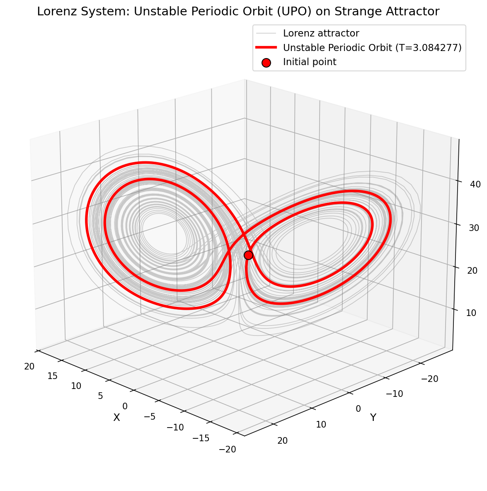

# Lorenz System: Unstable Periodic Orbit (UPO) Finder

## Author & License

**Author**: Dr. Denys Dutykh, Khalifa University of Science and Technology, Abu Dhabi, UAE  
**Date**: May 16, 2025  
**License**: GNU Lesser General Public License v3.0 (LGPL-3.0)

## Overview

This Python script locates Unstable Periodic Orbits (UPOs) in the Lorenz system, a paradigmatic model of chaotic dynamics, using numerical optimization and automatic differentiation. UPOs are critical as they form the "skeleton" of chaotic attractors, providing insight into the structure of chaos. The script combines advanced computational techniques with robust mathematical formulations to achieve this goal.

### Key Features

- **Initial Guess Generation**: Uses a k-d tree for nearest neighbor search to find close returns in a chaotic trajectory.
- **Numerical Optimization**: Minimizes a differentiable cost function using the L-BFGS algorithm.
- **Automatic Differentiation**: Leverages PyTorch's autograd for exact gradient computation.
- **Numerical Integration**: Utilizes the DOPRI5 (Dormand-Prince) ODE solver with strict tolerances.
- **Visualization**: Generates 3D plots of the UPO and optimization history.

### Example Output

Below is a visualization of a periodic orbit found by the code, shown in red against the background of the Lorenz attractor:



The plot shows the three-dimensional trajectory of the periodic solution (in red) embedded within the chaotic attractor (in gray). The initial point is marked with a red dot.

## Algorithm Description

### 1. Initial Guess Generation

- **Trajectory Generation**: Integrates the Lorenz system over a long time (T_final=2000) with many steps (n_steps=400000) from a random initial condition within specified bounds.
- **Nearest Neighbor Search**: Constructs a k-d tree from the trajectory to efficiently find pairs of points that are close in phase space (small Euclidean distance) but separated by a time within a specified range (t_min=4.0 to t_max=8.0).
- **Selection**: Identifies the pair with the smallest distance as the initial guess, providing an estimated period (T₀) and initial state ((x₀, y₀, z₀)).

This leverages the recurrence property of chaotic systems, where trajectories revisit neighborhoods in phase space, hinting at periodic behavior.

### 2. Cost Function Definition

The optimization problem is formulated as minimizing a cost function:

- **Periodicity Residual**: |φ(T, x₀) - x₀|², where φ(T, x₀) is the state after integrating from x₀ for time T. This measures how close the trajectory returns to its starting point.
- **Penalty Term**: λ/(|f(x₀)|² + ε), where f(x₀) is the Lorenz vector field at x₀, λ = 10⁻³ is a penalty weight, and ε = 10⁻¹² ensures numerical stability. This term prevents convergence to equilibrium points (where f(x₀) = 0).

The period T is parameterized as T = t_min + e^(log T) (with t_min = 1.0), transforming the constrained problem (T > t_min) into an unconstrained one.

### 3. Optimization

- **Setup**: Initializes the parameter vector u = [x₀, y₀, z₀, log T] with gradients enabled.
- **L-BFGS**: Uses the Limited-memory Broyden–Fletcher–Goldfarb–Shanno algorithm to minimize the cost function, adjusting u iteratively. The optimizer uses PyTorch's automatic differentiation for gradients.
- **Convergence**: Monitors cost, residual norm, and gradient norm, stopping when the relative cost change is below a tolerance (tol=1e-6) or after a maximum number of iterations (max_iter=500).

### 4. Verification

- Integrates the optimized solution over multiple periods (e.g., 3T) to check how closely it returns to the initial state, computing error norms at T, 2T, and 3T.

### 5. Visualization

- **3D Plot**: Displays the UPO in red against a gray Lorenz attractor background.
- **History Plot**: Shows optimization metrics (cost, residual norm, period, gradient norm) over iterations.

## Underlying Methods and Ideas

### Lorenz System

The Lorenz system is defined by:

```
dx/dt = σ(y - x)
dy/dt = x(ρ - z) - y
dz/dt = xy - βz
```

with parameters σ = 10, ρ = 28, β = 8/3, producing the iconic butterfly-shaped chaotic attractor.

### Unstable Periodic Orbits (UPOs)

UPOs are periodic solutions embedded in chaotic attractors, unstable due to positive Lyapunov exponents. They densely populate the attractor, organizing its dynamics. Finding UPOs numerically is challenging due to their instability, requiring precise methods.

### Automatic Differentiation

Automatic differentiation (AD) computes exact derivatives of functions defined by code, unlike numerical differentiation (prone to errors) or symbolic differentiation (computationally intensive). PyTorch's autograd tracks operations on tensors, applying the chain rule to compute gradients of the cost function with respect to u, enabling efficient optimization.

### L-BFGS Optimization

The L-BFGS algorithm is a quasi-Newton method that approximates the Hessian matrix using limited memory (history size = 25 in the script). It excels in smooth, high-dimensional optimization problems, balancing computational efficiency and convergence speed. Here, it minimizes the cost function, guided by exact gradients from AD.

### Numerical Integration

The DOPRI5 solver, a 5th-order Runge-Kutta method with adaptive step-sizing (Dormand-Prince), integrates the ODEs. Strict tolerances (rtol=1e-9, atol=1e-9) ensure high accuracy in computing φ(T, x₀), critical for gradient calculations and periodicity assessment.

### Equilibrium Avoidance

The penalty term λ/(|f(x₀)|² + ε) increases the cost near equilibria, where |f(x₀)| ≈ 0, steering the optimizer toward periodic solutions.

## Libraries Used

### PyTorch

- **Role**: Core library for tensor operations and automatic differentiation.
- **Key Features**:
  - **Autograd**: Computes gradients automatically, central to the optimization process.
  - **torchdiffeq**: Provides odeint for ODE integration, interfacing DOPRI5 with PyTorch tensors.
- **Why Used**: Enables seamless integration of numerical integration and optimization with gradient tracking.

### NumPy

- **Role**: Handles array operations, particularly in initial guess generation.
- **Key Features**: Fast numerical computations and interfacing with SciPy.

### SciPy

- **Role**: Provides cKDTree for efficient nearest neighbor searches.
- **Key Features**: Accelerates the initial guess phase by quickly identifying close points in the trajectory.

### Matplotlib

- **Role**: Generates visualizations (3D orbit and optimization history).
- **Key Features**: Flexible plotting capabilities for scientific data.

## Background Information

### Chaotic Dynamics

Chaotic systems exhibit sensitivity to initial conditions and aperiodic behavior, yet UPOs provide a structured framework within the chaos. The Lorenz system, introduced by Edward Lorenz in 1963, is a foundational example.

### Optimization Theory

Gradient-based optimization, like L-BFGS, relies on the smoothness of the objective function. The script's use of AD ensures accurate gradients, enhancing convergence reliability.

### Numerical Analysis

High-precision ODE solvers like DOPRI5 balance accuracy and efficiency, crucial for chaotic systems where small errors can amplify exponentially.

## Command-Line Options

- `--rtol FLOAT`: ODE solver relative tolerance (default: 1e-9)
- `--atol FLOAT`: ODE solver absolute tolerance (default: 1e-9)
- `--lambda FLOAT`: Penalty weight (default: 1e-3)
- `--max-iter INT`: Maximum L-BFGS iterations (default: 500)
- `--tol FLOAT`: Optimization convergence tolerance (default: 1e-6)

## Example Usage

```bash
# Default run
python lorenz_periodic_orbit.py

# Custom parameters
python lorenz_periodic_orbit.py --lambda 0.001 --max-iter 1000 --tol 1e-7

# High-precision integration
python lorenz_periodic_orbit.py --rtol 1e-10 --atol 1e-10
```

## Output

- **Files**: Saves lorenz_periodic_orbit.png (3D plot) and lorenz_periodic_orbit_history.png (optimization history) in the images/ directory.
- **Console**: Prints convergence details, verification results, and final orbit parameters.

## Requirements

- Python 3.6+
- PyTorch
- torchdiffeq
- NumPy
- SciPy
- Matplotlib (for visualization)

## References

- Lorenz, E. N. (1963). "Deterministic Nonperiodic Flow." Journal of the Atmospheric Sciences, 20(2), 130-141.
- Viswanath, D. (2003). "The Fractal Property of the Lorenz Attractor." Physica D: Nonlinear Phenomena, 190(1-2), 115-128.
- Broyden, C. G., et al. (1970). "The Convergence of a Class of Double-rank Minimization Algorithms." Journal of the Institute of Mathematics and Its Applications.
